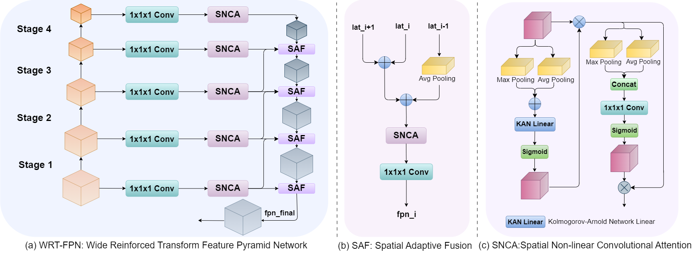
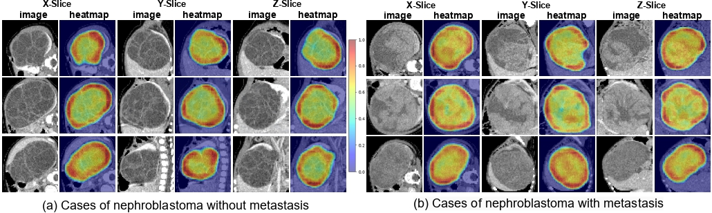

# MT-WilmsNet: A Multi-Level Transformer Fusion Network for Wilms’ Tumor Segmentation and Metastasis Prediction

## Table of Contents
- [Overview](#overview)
- [Requirements](#requirements)
- [Training](#training)
- [Evaluation](#evaluation)
- [Results](#results)
- [Future Work](#future-work)

## :sound:Overview
A multi-task framework combining tumor segmentation and metastasis prediction using CT imaging data. Designed to reduce dependency on PET-CT scans while maintaining diagnostic accuracy for Wilms’ Tumor (WT).


WRT-FPN


## :clipboard:Requirements
Install dependencies:
```bash
pip install -r requirements.txt
```
## :rainbow:Training
To train our model in the paper, run this command:
```bash
python train.py
```
### 📜Data Preparation
preprocessing
First we need two folders
```bash
cd root
mkdir "./data/Wilms_tumor_raw_CT_data"
mkdir "./data/Wilms_tumor_training_data"
```
Download Wilms_tumor_raw_CT_data(Due to privacy and ethical issues, the original CT data can be downloaded after applying and licensing to us and relevant hospitals). 
   
Then open the zip file and extract the connect into the Wilms_tumor_raw_CT_data directory. Once the files are moved properly, you should see the following folder structure:

```bash
root/data/
|——Wilms_tumor_raw_CT_data
|                      |——Data0
|                      |      |——1_image.nrrd
|                      |       ——1_label.nrrd
|                      |      |——2_image.nrrd
|                      |       ——2_label.nrrd
|                      |      |——...
|                      |---Data1
|                      |      |——3_image.nrrd
|                      |       ——3_label.nrrd
|                      |      |——...
|                      |---Data3-0
|                      |      |——...
|                      |---Data3-1
|                      |      |——...

```
Then the data is transformed using dataprocess.py
```bash
python dataprocess.py
```
If you have successfully converted the data, you will see the following file structure
```bash
root/data/
|——Wilms_tumor_training_data
|                        |——train
|                        |      |——0
|                        |      |   |——sm1_1.nrrd
|                        |      |    ——sm1_1_mask.nrrd
|                        |      |   |——sm1_2.nrrd
|                        |      |    ——sm1_2_mask.nrrd
|                        |      |   |——...
|                        |      |——1
|                        |      |   |——sm1_3.nrrd
|                        |      |    ——sm1_3.mask.nrrd
|                        |      |   |——...
|                        |——test
|                        |      |——0
|                        |      |   |——...
|                        |      |——1
|                        |      |   |——...

```
## :star2:inference
To inference our model in the paper, run this command:
```bash
python visualzation/inference.py
```

## :page_with_curl:Results
### 💡 Quantitative Comparison
| Model               | AUC ↑ | ACC ↑ | Specificity ↑ | Sensitivity ↑ | F1-score ↑ | DSC ↑ | JI↑ | ASD ↓ | HD95 ↓ |
|---------------------|-------|-------|---------------|---------------|------------|-------|-----|-------|--------|
| **Classification**  |       |       |               |               |            |       |     |       |        |
| VIVIT               | 0.5432| 0.5411| 0.6444        | 0.3225        | 0.3855     | \     | \   | \     | \      |
| Radiomics           | 0.6414| 0.5752| 0.5101        | 0.6364        | 0.6222     | \     | \   | \     | \      |
| MedicalNet          | 0.7313| 0.7013| 0.8052        | 0.4477        | 0.5541     | \     | \   | \     | \      |
| MTS-Net             | 0.6907| 0.7250| 0.7222        | 0.7273        | 0.7442     | \     | \   | \     | \      |
| **Segmentation**    |       |       |               |               |            |       |     |       |        |
| MAPSeg              | \     | \     | \             | \             | \          | 0.8543| 0.7491| 4.2043| 27.7468|
| SwinUNETR           | \     | \     | \             | \             | \          | 0.8861| 0.8104| 3.3934| 14.6179|
| SAM-Med3D           | \     | \     | \             | \             | \          | 0.9225| 0.8574| 0.6931| 2.9094|
| MT-WilmsNet (Ours)  | **0.8712**| **0.8501**| **0.7778**    | **0.9091**    | **0.8696** | **0.9231**| **0.8597**| **0.6452**| **2.7188**|

> **Note:** Quantitative comparison with different models on the private WT dataset. The optimal results are shown in bold.


 ### 💡 Ablation Study
 | w/o | AUC ↑ | ACC ↑ | Specificity ↑ | Sensitivity ↑ | F1 Score ↑ | DSC ↑ | JI ↑ | ASD ↓ | HD95 ↓ |
|-----|-------|-------|---------------|---------------|------------|-------|------|-------|--------|
| Baseline | 0.7551 | 0.7250 | 0.8333 | 0.6364 | 0.7179 | \     | \    | \    | \    |
| +GSA | 0.7904 | 0.7500 | 0.6111 | 0.8636 | 0.7917 | \     | \    | \    | \    |
| +Self-Distillation | 0.8056 | 0.8011 | 0.8333 | 0.7277 | 0.8095 | \     | \    | \    | \    |
| +Multi-task | 0.8157 | 0.8496 | **0.8889** | 0.8182 | 0.8571 | 0.9211 | 0.8566 | 0.6699 | 2.7753 |
| +WRT-FPN | **0.8712** | **0.8501** | 0.7778 | **0.9091** | **0.8696** | **0.9231** | **0.8597** | **0.6452** | **2.7188** |

>  **Note:** Ablation study performance with progressively added modules.The optimal results are shown in bold.
  ### :sunny: Visualization

  
  

## :kissing_cat:Future Work
Towards Foundation Model for CT Analysis
